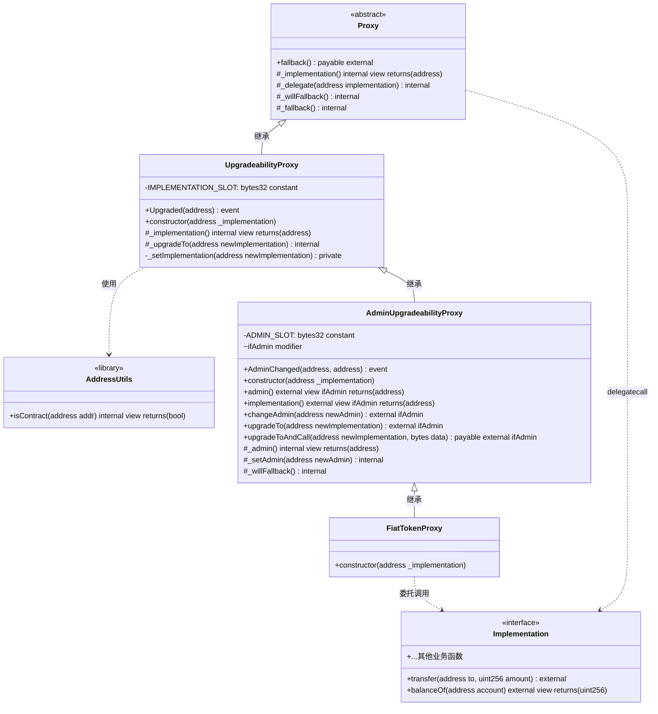
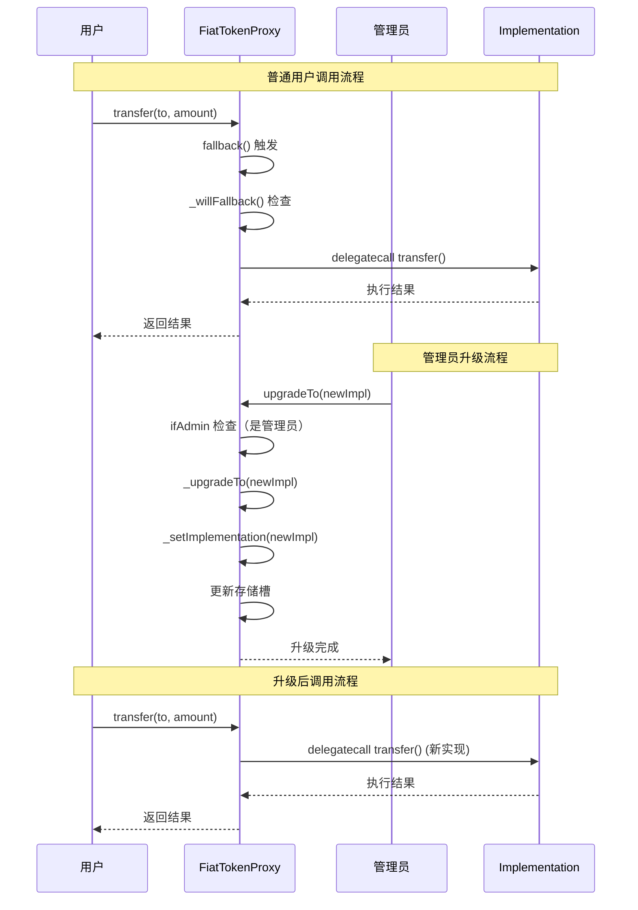
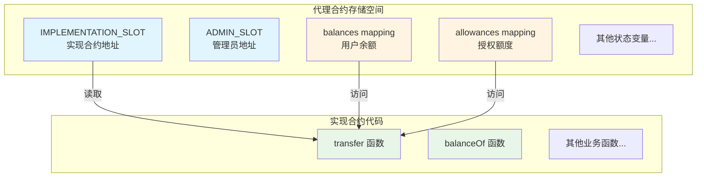
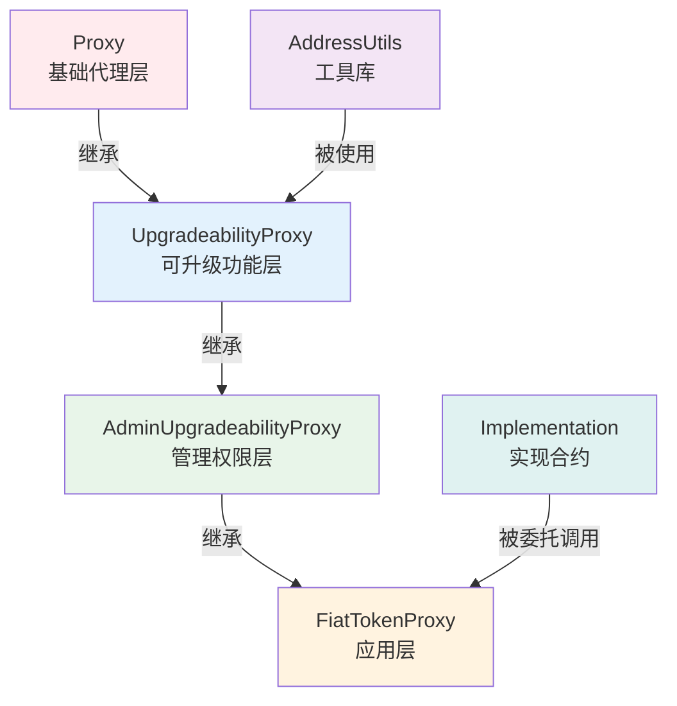

# Solidity 可升级合约 UML 类图

## UML 类图（Mermaid 格式）

## 详细类图说明

### 1. Proxy（基础代理类）

**类型**：抽象合约

**职责**：

- 实现代理模式的核心机制
- 提供回退函数捕获所有调用
- 使用 delegatecall 转发调用到实现合约

**关键方法**：

- `fallback()`: 外部回退函数，接收以太币
- `_delegate()`: 核心委托逻辑，使用汇编实现
- `_implementation()`: 抽象方法，由子类实现

**关系**：

- 被 `UpgradeabilityProxy` 继承

---

### 2. AddressUtils（地址工具库）

**类型**：库（Library）

**职责**：

- 提供地址相关的工具函数
- 检查地址是否为合约

**关键方法**：

- `isContract()`: 通过检查代码大小判断是否为合约

**关系**：

- 被 `UpgradeabilityProxy` 使用

---

### 3. UpgradeabilityProxy（可升级代理类）

**类型**：具体合约

**职责**：

- 实现可升级功能
- 管理实现合约地址
- 提供升级接口

**关键属性**：

- `IMPLEMENTATION_SLOT`: 存储实现地址的存储槽

**关键方法**：

- `_implementation()`: 从存储槽读取实现地址
- `_upgradeTo()`: 升级到新实现
- `_setImplementation()`: 设置实现地址（私有）

**事件**：

- `Upgraded`: 实现升级时触发

**关系**：

- 继承自 `Proxy`
- 使用 `AddressUtils`
- 被 `AdminUpgradeabilityProxy` 继承

---

### 4. AdminUpgradeabilityProxy（管理员可升级代理类）

**类型**：具体合约

**职责**：

- 添加管理员权限控制
- 提供管理接口
- 智能路由（管理员 vs 普通用户）

**关键属性**：

- `ADMIN_SLOT`: 存储管理员地址的存储槽

**关键方法**：

- `admin()`: 获取管理员地址（仅管理员可调用）
- `implementation()`: 获取实现地址（仅管理员可调用）
- `changeAdmin()`: 更改管理员（仅管理员可调用）
- `upgradeTo()`: 升级实现（仅管理员可调用）
- `upgradeToAndCall()`: 升级并初始化（仅管理员可调用）
- `ifAdmin`: 修饰符，智能路由

**事件**：

- `AdminChanged`: 管理员变更时触发

**关系**：

- 继承自 `UpgradeabilityProxy`
- 被 `FiatTokenProxy` 继承

---

### 5. FiatTokenProxy（USDC 代理类）

**类型**：具体合约（应用层）

**职责**：

- USDC 代币的代理合约实例
- 连接代理机制和业务逻辑

**关键方法**：

- `constructor()`: 初始化，设置实现合约地址

**关系**：

- 继承自 `AdminUpgradeabilityProxy`
- 委托调用到 `Implementation`（FiatToken 实现合约）

---

### 6. Implementation（实现合约接口）

**类型**：接口/合约

**职责**：

- 包含实际的业务逻辑
- 不存储状态（状态存储在代理合约中）

**关键方法**：

- `transfer()`: 转账函数
- `balanceOf()`: 查询余额
- 其他业务相关函数

**关系**：

- 被 `FiatTokenProxy` 通过 delegatecall 调用

---

## 调用关系图

## 存储布局图

## 模块依赖关系

## 关键设计模式

1. **代理模式（Proxy Pattern）**
   - Proxy 作为代理，Implementation 作为实际对象
   - 通过 delegatecall 实现透明代理

2. **模板方法模式（Template Method Pattern）**
   - `_fallback()` 定义算法骨架
   - `_willFallback()` 允许子类扩展

3. **策略模式（Strategy Pattern）**
   - `ifAdmin` 修饰符根据调用者选择不同策略
   - 管理员：执行管理功能
   - 普通用户：转发到实现合约

4. **非结构化存储模式（Unstructured Storage Pattern）**
   - 使用哈希槽存储关键数据
   - 避免存储布局冲突
